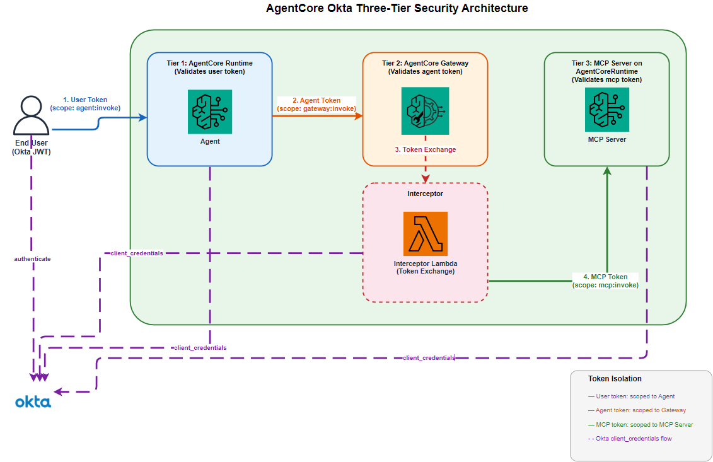
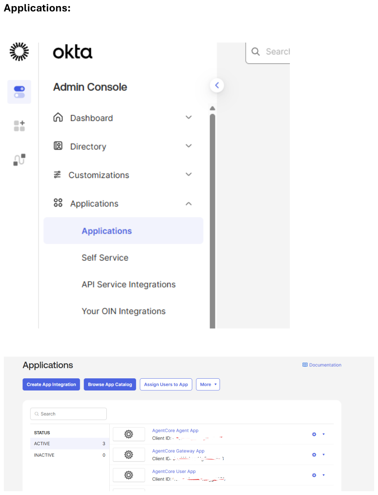
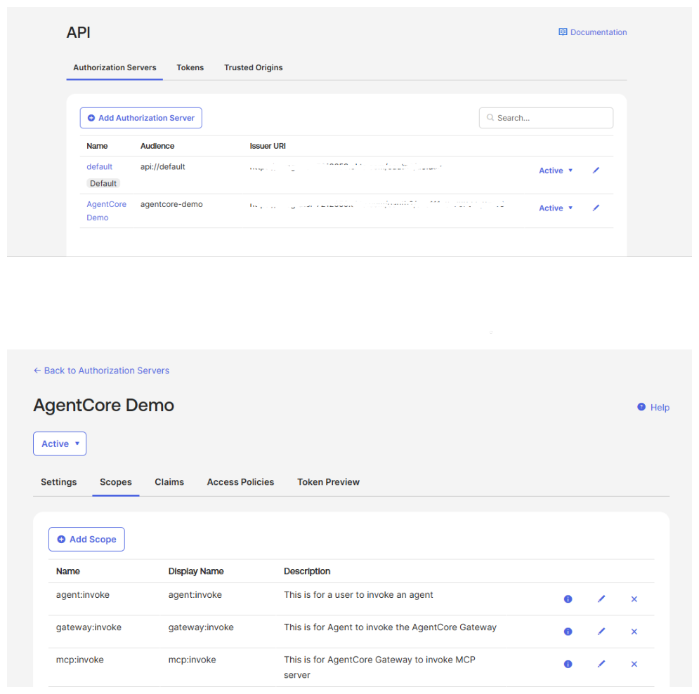
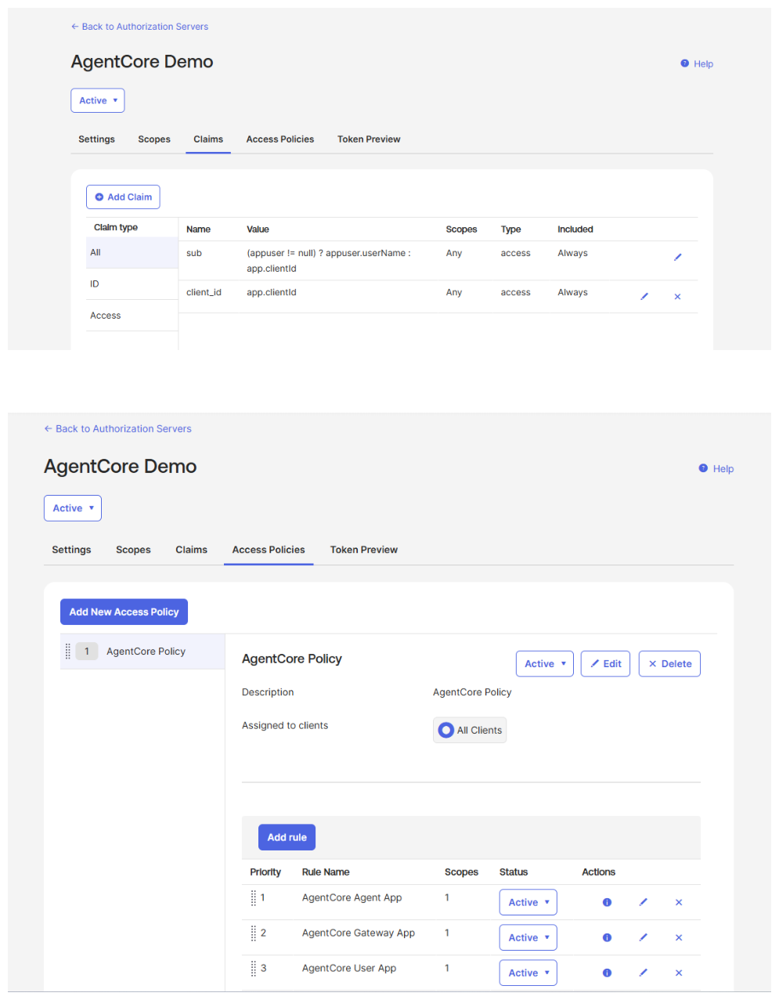
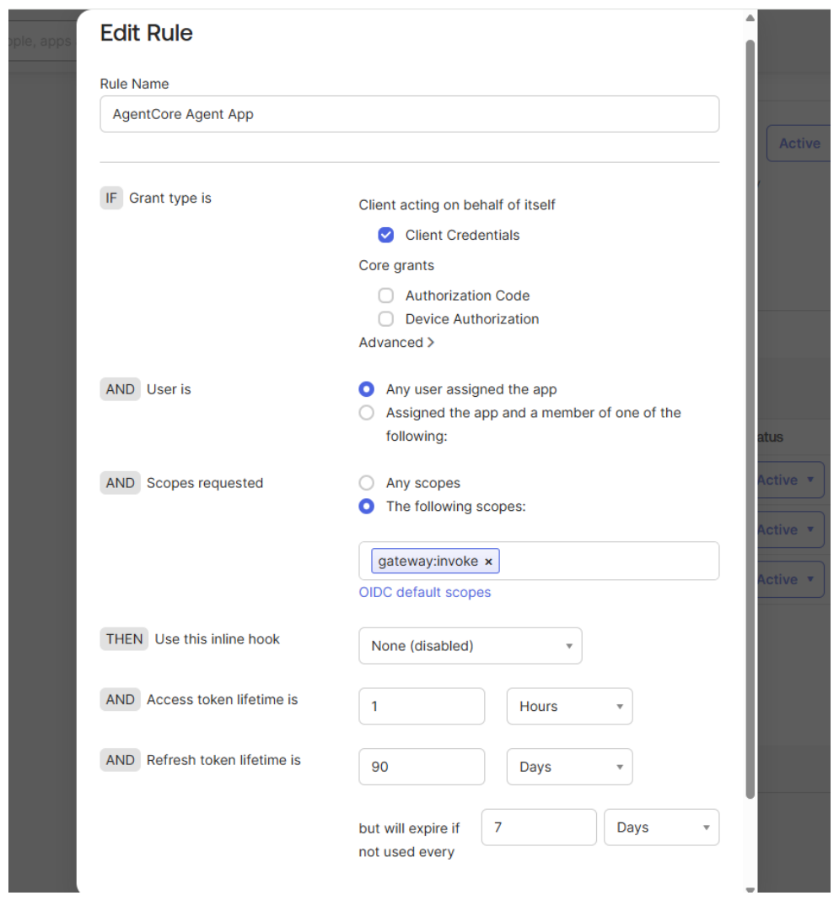
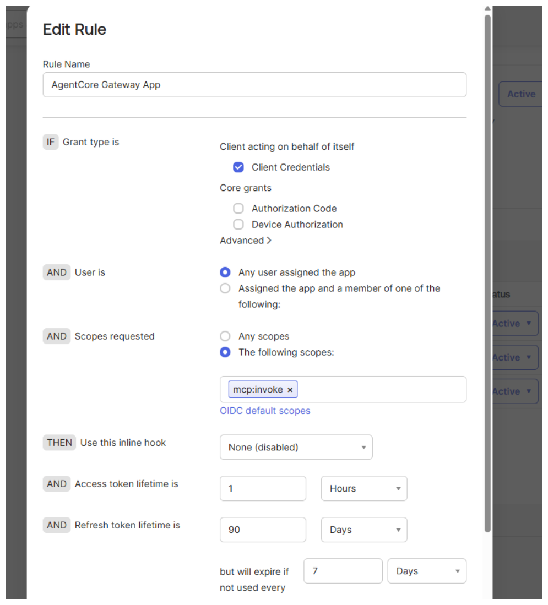
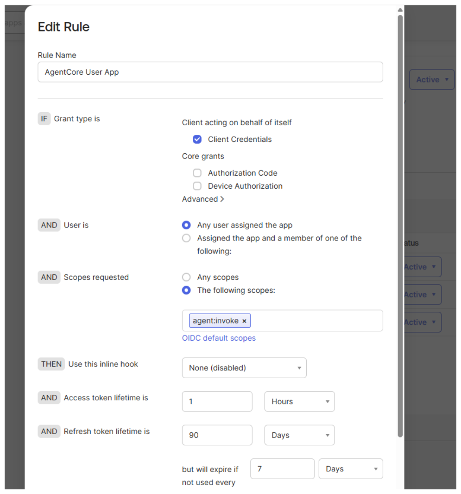

# Okta OAuth2 Three-Tier Authentication with Amazon Bedrock AgentCore

Per-tier token isolation with pure Okta OAuth2 authentication — no IAM credentials for agents.

## Architecture



```
User (Okta JWT: agent:invoke)
  ↓ Validates user token via Okta OIDC
Agent Runtime (Okta JWT: gateway:invoke)
  ↓ Validates agent token via Okta OIDC + allowedAudience
Gateway
  ├─ OAuth2 Credential Provider (tool sync — control plane)
  └─ Interceptor Lambda (token exchange — data plane)
  ↓ Fresh Okta JWT (scope: mcp:invoke)
MCP Server Runtime
  ↓ Validates MCP token via Okta OIDC
  ↓ Returns real estate project data
```

### Control Plane (Tool Sync)

```
Gateway → OAuth2 Credential Provider → MCP Server
```

Happens once during Gateway target creation. Uses OAuth2 `client_credentials` grant to discover available tools.

### Data Plane (Runtime Requests)

```
User → Agent Runtime → Gateway → Interceptor Lambda → MCP Server
```

Happens on every tool call. The Interceptor Lambda exchanges the Agent token for a fresh MCP token. No token is ever forwarded downstream.

## Token Isolation

| Token | Scope | Issued To | Used For |
|-------|-------|-----------|----------|
| User Token | `agent:invoke` | End user | Call Agent Runtime |
| Agent Token | `gateway:invoke` | Agent Runtime | Call Gateway |
| MCP Token | `mcp:invoke` | Gateway Interceptor | Call MCP Server |

Each tier validates its inbound JWT via Okta OIDC (signature, expiry, audience, issuer). No token is ever forwarded downstream — each tier fetches its own scoped token.

## Custom Security Headers (End-to-End)

Three custom headers propagate the end-user's identity from the caller all the way to the MCP Server:

| Header | Purpose |
|--------|---------|
| `X-Amzn-Bedrock-AgentCore-Runtime-Custom-End-User-Id` | Caller's user ID |
| `X-Amzn-Bedrock-AgentCore-Runtime-Custom-End-User-Dept` | Caller's department |
| `X-Amzn-Bedrock-AgentCore-Runtime-Custom-End-User-Role` | Caller's role |

**Propagation flow:**
```
User (HTTP headers) → Agent Runtime → Gateway → Interceptor Lambda → MCP Server
```

The Interceptor Lambda extracts these headers from the inbound Gateway request and injects them into the JSON-RPC body as `params._meta.security_context`. The MCP Server's ASGI middleware reads from HTTP headers first, then falls back to the `_meta` body field, making the security context available to every tool via `get_security_context()`.

Each tool response includes a `_security_context` field so callers can verify the headers arrived.

## Prerequisites

- Python 3.10+
- AWS credentials configured with AgentCore permissions
- Okta developer account with:
  - 1 custom Authorization Server
  - 3 OAuth2 apps (Agent, Gateway, User) — each with Client Credentials grant
  - 3 scopes (`agent:invoke`, `gateway:invoke`, `mcp:invoke`)
  - DPoP disabled on all apps

## Okta Setup

See the notebook's **Okta Setup Reference** section for step-by-step screenshots.

For a detailed walkthrough, see the [Step-by-Step Okta Integration for Gateway Auth](https://github.com/awslabs/amazon-bedrock-agentcore-samples/blob/main/01-tutorials/03-AgentCore-identity/08-IDP-examples/Okta/Step_by_Step_Okta_Integration_for_Gateway_Auth.ipynb) notebook.

### 1. Applications

Create three API Service Integration apps in **Applications > Applications**:



### 2. Authorization Server

Navigate to **Security > API** and create a custom authorization server:


### 3. Scopes

Define three scopes on the authorization server:



### 4. Claims and Access Policies

Add a `client_id` claim and create an access policy with three rules:



### 5. Access Policy Rules

Each rule uses Client Credentials grant and restricts to a single scope:

| Rule | App | Scope |
|------|-----|-------|
| AgentCore Agent App | Agent Runtime | `gateway:invoke` |
| AgentCore Gateway App | Interceptor Lambda | `mcp:invoke` |
| AgentCore User App | End User | `agent:invoke` |





## Getting Started

The notebook `okta-auth-three-tier-end-to-end-demo.ipynb` walks through the full deployment:

1. Install dependencies and configure environment
2. Deploy MCP Server to AgentCore Runtime (Tier 3)
3. Deploy AgentCore Gateway with Interceptor Lambda (Tier 2)
4. Deploy Agent Runtime (Tier 1)
5. Test the full chain: User → Agent → Gateway → MCP Server
6. Verify token isolation
7. Cleanup all resources

## Project Structure

```
├── okta-auth-three-tier-end-to-end-demo.ipynb   # Main deployment notebook
├── mcp_server.py                # MCP Server with security header middleware
├── requirements.txt             # Python dependencies for MCP Server container
├── agent_runtime/
│   ├── agent_server.py          # Agent Runtime (Tier 1)
│   └── requirements.txt         # Agent Runtime dependencies
├── images/                      # Architecture diagram and Okta setup screenshots
├── Dockerfile                   # Auto-generated by starter toolkit
└── .env.example                 # Environment variable template
```

## Key Learnings

1. **OAuth2 Credential Provider** is for tool sync (control plane only)
2. **Interceptor Lambda** is for runtime token exchange (data plane)
3. **`allowedAudience`** must be configured in Gateway authorizer
4. **`requestHeaderAllowlist`** does not pass custom HTTP headers to the container — use body `_meta` injection via the Interceptor instead
5. **Target prefix** must be short to keep tool names under 64 chars
6. **`mcp.server.fastmcp.FastMCP`** (built into the `mcp` SDK) is required — not the separate `fastmcp` PyPI package
7. **DPoP must be disabled** on all Okta apps
8. **`print()` in MCP tools** goes to container stdout, not the client — use tool return values to surface data

## Resources

- [Amazon Bedrock AgentCore Documentation](https://docs.aws.amazon.com/bedrock-agentcore/)
- [Okta Developer Docs](https://developer.okta.com/)
- [MCP Protocol Spec](https://modelcontextprotocol.io/)
- [OAuth2 RFC 6749](https://tools.ietf.org/html/rfc6749)
